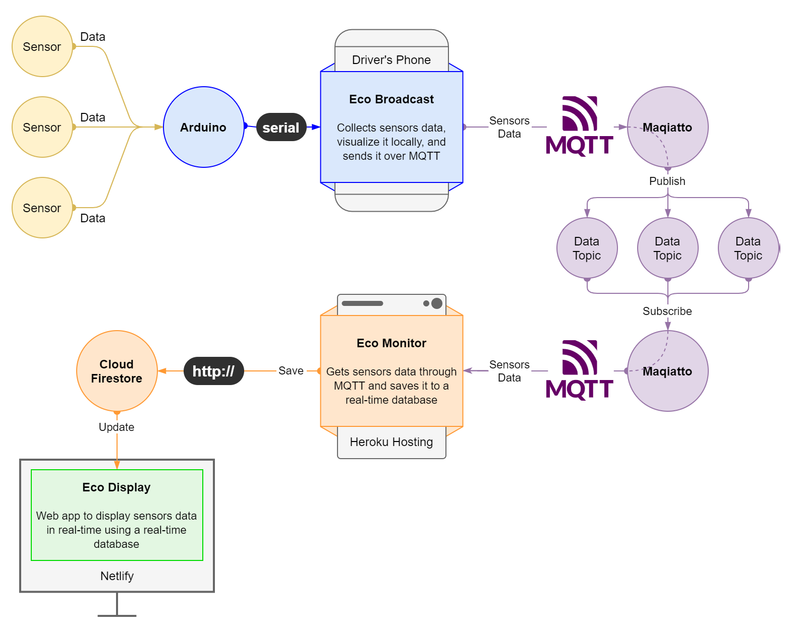

# Eco-Monitor

**Eco-Monitor** is the mid point for [Cairo University Eco Racing Team](https://www.facebook.com/ShellEcoMarathonCUT) telemetry system (so-called _Eco-Telemetry_).

## Role in Eco-Telemetry

Receives sensor data sent over MQTT by [Eco-Broadcast](https://github.com/adhammo/eco-broadcast) and saves it in ([Cloud Firestore](https://firebase.google.com/docs/firestore)) for [Eco-Display](https://github.com/adhammo/eco-display) to display it in real-time.

# Eco-Telemetry

A system to collect and send sensor data over the internet to be displayed and monitored in real-time.

## Eco-Telemetry description

An arduino collects and sends sensor data through serial to [Eco-Broadcast](https://github.com/adhammo/eco-broadcast) which in turn sends it through an MQTT Broker ([Maqiatto.com](https://www.maqiatto.com/)) to [Eco-Monitor](https://github.com/adhammo/eco-monitor) which saves it to a real-time database ([Cloud Firestore](https://firebase.google.com/docs/firestore)) which updates, on change, [Eco-Display](https://github.com/adhammo/eco-display) where the data can be seen in real-time.
